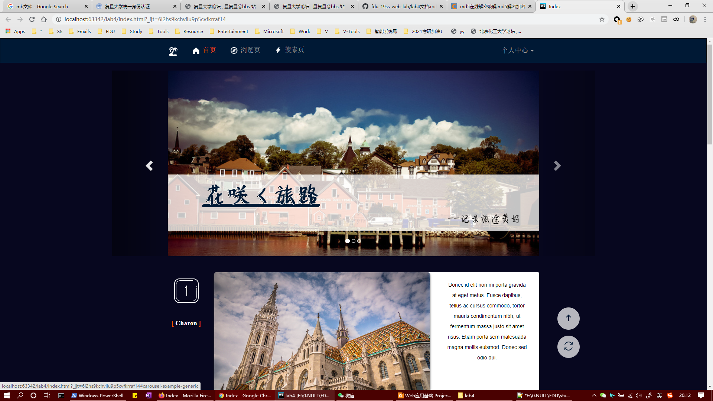

LAB 4 文档
==========
 --杨妍 17307130329
-------------------

## 整体设计

本主页主要分成四个部分，包括导航栏、头图、小图简介、脚注，还有两个悬浮在页面旁边的按钮。
整体主题使用深蓝色调，文字和图片部分用白色作为主题色，更能衬托出作为图片网站的美观。

-------------------

## 亮点介绍

1. 导航栏和小图介绍都有鼠标悬浮时的高亮显示或背景变化。
2. 首页使用一致的圆角、阴影、边框，卡片形式突出。
3. 网页使用较多svg或小img用作标志，增强可读性。
4. 占主要部分的6张图片均采用左边标题及用户、中间大图、右侧简介的布局，样式清晰大方。

-------------------

## 主页截图

如下：

